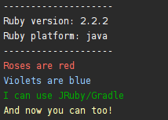
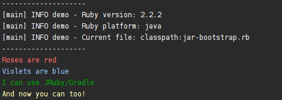

= JRuby/Gradle
:page-layout: base

link:https://github.com/jruby-gradle/[JRuby/Gradle] is a collection of
link:http://www.gradle.org[Gradle] plugins which make it easy to build, test,
manage and package Ruby applications. By combining the portability of
link:http://jruby.org[JRuby] with Gradle's excellent task and dependency
management, *JRuby/Gradle* provides high quality build tooling for
Ruby and Java developers alike.

NOTE: As from version 1.6.0 you will need at last Gradle 2.8.

*Plugins available:*

* link:base/[Base]
* link:jar/[Jar]
* link:war/[War]
* link:storm/[Storm]

== Quick Start

=== Running some Ruby

The simplest example is a hello-world from Gradle, using JRuby/Gradle we can
execute a Ruby script, which has Ruby-based dependencies:

.build.gradle (link:https://github.com/jruby-gradle/jruby-gradle-plugin/blob/master/examples/run-simple-ruby-script/build.gradle[full source])
[source, gradle]
----
include::../examples/run-simple-ruby-script/build.gradle[lines=6..30]
----

.print-script.rb (link:https://github.com/jruby-gradle/jruby-gradle-plugin/blob/master/examples/run-simple-ruby-script/print-script.rb[full source])
[source, ruby]
----
include::../examples/run-simple-ruby-script/print-script.rb[]
----

Executing `./gradlew printSomePrettyOutputPlease` results in the following:

=== Packaging some Ruby

.build.gradle (link:https://github.com/jruby-gradle/jruby-gradle-plugin/blob/master/examples/self-executing-jar/build.gradle[full source])
[source, gradle]
----
include::../examples/self-executing-jar/build.gradle[lines=6..40]
----

.entrypoint.rb (link:https://github.com/jruby-gradle/jruby-gradle-plugin/blob/master/examples/self-executing-jar/entrypoint.rb[full source])
[source, ruby]
----
include::../examples/self-executing-jar/entrypoint.rb[]
----

Executing `./gradlew jrubyJar` will build a `.jar` file inside of the
`build/libs` directory which can then be invoked:

`% java -jar build/libs/self-executing-jar-jruby.jar`

